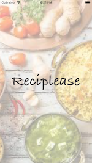
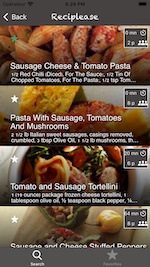
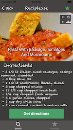

# Reciplease 
Reciplease offers recipes based on a list of entered ingredients.

Possibility to bookmark a selection of recipes

         

### API
API Rest EDAMAM

### SKILLS
* MVC, Singleton Pattern
* Network with Alamofire
* TableView, NavigationController
* Unit Test, UITest
* Generic class
* Protocol
* CoreData

### PODS
* SwiftLint: A tool to enforce Swift style and conventions
* Alamofire: HTTP networking library